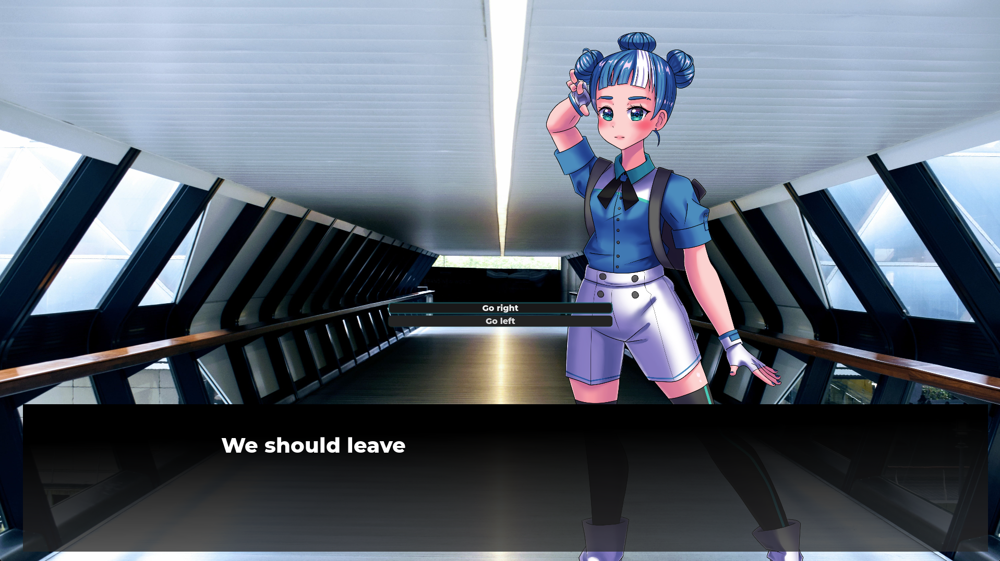
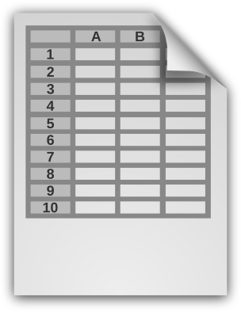

# #️⃣💬 Godot CSharp Dialogue Template

This a simple dialogue template for Godot 4 written in C#. You can use it for your visual novel or as a dialogue system in any other type of game.

## Supported Formates

 

Dialogues can be read from JSON and TSV files.

## The ScenePlayer

ScenePlayer displays and manages a dialogue scene. Instantiate this scene as a child of your game window, load your timeline with Timeline.LoadTimeline and start your dialogue with the ScenePlayer RunScene method.

## Timeline

The Timeline class provides a method to load dialogue data from TSV and JSON and a custom TimelineEvent class for the scene data.

### TimelineEvent Fields

TimelineEvents can be expanded and restructured depending on your needs. Here are some of the default fields.

`Eventid`: Unique int id, used as the key in SceneData dictionary. Every Scene has to start with Eventid 0 and end with -1

`Next`: Eventid of the next event

`Line`: Text that is displayed in textbox

`ChoiceLabel`: Text of the choice button

`Choices`: list of choice Eventids

`Character`: character Id; if none is specified, the narrator resource will be loaded

`Animation`: character animation; enter, leave

`Position`: "outer_right", "right",  "middle", "left", "outer_left";

`ChangeBackground`: background id

`Transition`: animation of the ScenePlayer; fadeIn, fadeOut

## Sample Assets

Godette sprites by [shatteredreality](https://shatteredreality.itch.io/); original design by [Andrea Calabrò](https://github.com/godotengine/godot-design/tree/master/godette) under a Creative Commons Attribution 4.0 International Public License.